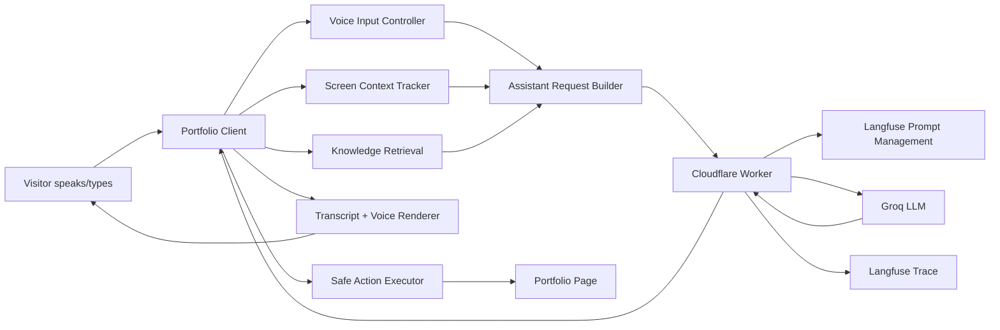

# Implementation Plan: Context-Aware Voice Assistant

## 1. Objective

Build **Ask Abhishek Copilot** as an add-on to the existing portfolio assistant.

The assistant should:

- Keep the current chat-first AI assistant working.
- Add a voice-first, context-aware guide mode.
- Understand the visible portfolio section.
- Answer conversationally in English, Hindi, and Hinglish.
- Move the page through safe, subtle actions such as scroll, highlight, carousel movement, and details reveal.
- Stay simple to build and deploy.
- Keep the MVP free or near-free by using browser-native voice features and the existing Cloudflare Worker/Groq/Langfuse setup.
- Be designed so a stronger realtime voice stack can be added later.

## 2. Current Foundation

Existing setup:

- Static portfolio in `index.html`.
- Public knowledge files in `knowledge/*.md`.
- Existing RAG-style retrieval in client JavaScript.
- Cloudflare Worker proxy in `api-proxy/worker.js`.
- Worker fetches production prompt from Langfuse.
- Worker calls Groq through an OpenAI-compatible chat completions API.
- Worker logs traces to Langfuse.
- Existing chat UI already supports conversation history and starter questions.

This implementation should extend the current system, not replace it.

## 3. Architecture Decision

### MVP Architecture

Use a **browser-native voice pipeline** for the first version:

- Browser Speech Recognition for speech-to-text where supported.
- Browser Speech Synthesis for text-to-speech.
- Existing Cloudflare Worker for LLM calls.
- Existing Groq model path for reasoning and response generation.
- Existing Langfuse setup for prompts, tracing, and later evaluation.
- Text fallback for unsupported browsers or failed microphone permissions.

Why this is the right first version:

- No audio files need to be sent to the server.
- No new paid speech API is required.
- The static portfolio can stay on GitHub Pages.
- The Worker remains a simple secure text API.
- It is fast to build and easy to debug.
- The same client contracts can support a future realtime voice provider.

### Future Architecture

Later, if the experience needs lower latency, better multilingual STT, barge-in, interruption handling, or more natural streaming speech, add a server-assisted or realtime voice layer.

Future upgrade options:

- Realtime voice API for low-latency speech-to-speech interaction.
- Server-side transcription for more reliable Hindi/Hinglish recognition.
- Dedicated TTS voices for a more polished assistant personality.
- Streaming partial responses and interruption support.
- Durable session memory for returning visitors, only if privacy expectations are clear.

## 4. Target System Overview



## 5. Core Voice Pipeline

The assistant should be modeled as a state machine.

| State | Trigger | UI | System Work |
|---|---|---|---|
| `idle` | Page loaded / turn complete | Orb calm glow | Ready for chat or voice. |
| `permission_request` | User taps mic first time | Browser permission prompt | Request microphone access. |
| `listening` | Mic active | Orb waveform/ring | Capture speech. |
| `transcribing` | Speech recognition interim/final | Live transcript text | Convert speech to text. |
| `thinking` | Final user text submitted | Orb breathing pulse | Build request and call Worker. |
| `acting` | Response has actions | Target glow / smooth movement | Execute safe page actions. |
| `speaking` | Spoken response available | Orb waveform pulse | Use speech synthesis. |
| `ready` | Response rendered | Orb returns calm | Await next turn. |
| `error` | Voice/API/action failure | Brief amber pulse | Show fallback and keep text input usable. |

Important behavior:

- Voice must be initiated by user action.
- Text fallback must always remain available.
- Spoken response should be concise and non-bulleted.
- Transcript can be richer and copyable.
- If the user asks a follow-up like "aur fintech mein?", conversation context and last highlighted card should help interpret it.

## 6. Client Components

Because the current site is a static `index.html`, the MVP can be implemented inline first. Once stable, split assistant code into a dedicated file such as `assets/assistant.js`.

### 6.1 Assistant Mode Controller

Responsibilities:

- Track `assistantMode`: `chat` or `voice_context`.
- Keep one shared conversation history.
- Preserve context when switching modes.
- Show one clear CTA:
  - `Switch to Voice Guide`
  - `Switch to Chat`

### 6.2 Voice Input Controller

Responsibilities:

- Detect browser support for `SpeechRecognition` / `webkitSpeechRecognition`.
- Configure candidate languages:
  - English: `en-IN` or `en-US`
  - Hindi: `hi-IN`
  - Hinglish: initially handled as English or Hindi input plus LLM language detection
- Capture interim transcript when available.
- Submit final transcript to the assistant.
- Handle:
  - permission denied
  - no speech detected
  - unsupported browser
  - network failure

MVP fallback:

- If speech recognition is unavailable, hide/disable mic and keep text input available.
- Show a short message: `Voice is not available in this browser. You can still type your question.`

### 6.3 Speech Output Controller

Responsibilities:

- Use `speechSynthesis` for spoken output.
- Select language based on `outputLanguage`.
- Speak only the `spoken` field from the response contract.
- Never speak markdown, bullets, action receipts, or hidden metadata.
- Stop current speech if the user starts a new voice turn.
- Respect browser autoplay/user-gesture limitations.

MVP behavior:

- English output is required.
- Hindi and Hinglish should be attempted through browser voices where available.
- If no suitable voice is available, keep transcript only.

### 6.4 Screen Context Tracker

Responsibilities:

- Use `IntersectionObserver` to detect current section:
  - `hero`
  - `work`
  - `impact`
  - `beyond`
  - `contact`
- Track visible assistant targets.
- Track work carousel index.
- Track selected product card.
- Track last assistant action for `go back` style behavior.

Client-side context shape:

```js
{
  assistantMode: "chat",
  inputModality: "voice",
  currentSection: "hero",
  visibleTargets: ["hero.brief", "product.aiAssistant"],
  selectedProductCard: null,
  workCarouselIndex: 0,
  lastAssistantAction: {
    type: "highlight",
    target: "hero.brief",
    previousScrollY: 0
  }
}
```

### 6.5 Semantic Target Map

The model should never receive permission to control arbitrary CSS selectors. The client should maintain a semantic target map.

Example:

```js
const ASSISTANT_TARGETS = {
  "section.hero": "#homepage",
  "hero.brief": "[data-assistant-target='hero-brief']",
  "section.work": "#work",
  "work.aiAssistant": "[data-assistant-target='work-ai-assistant']",
  "work.jioBlackRock": "[data-assistant-target='work-jioblackrock']",
  "work.jioMart": "[data-assistant-target='work-jiomart']",
  "section.impact": "#impact",
  "metric.aiDiscovery": "[data-assistant-target='metric-ai-discovery']",
  "metric.onboarding": "[data-assistant-target='metric-onboarding']",
  "metric.support": "[data-assistant-target='metric-support']",
  "section.contact": "#contact",
  "contact.email": "[data-assistant-target='contact-email']",
  "contact.resume": "[data-assistant-target='contact-resume']"
};
```

Required markup changes:

- Add `data-assistant-target` attributes to meaningful portfolio elements.
- Keep existing IDs and UI behavior intact.
- Do not restructure the whole page for the assistant.

### 6.6 Safe Action Executor

Allowed actions:

| Action | Purpose |
|---|---|
| `scrollTo` | Smoothly move to a known section. |
| `highlight` | Apply temporary subtle glow to a known target. |
| `carouselTo` | Move work carousel to a known index. |
| `openDetails` | Trigger existing product details button. |
| `modeSwitch` | Switch between chat and voice guide. |
| `openAllowedExternal` | Open only predefined contact/resume links. |
| `undoNavigation` | Restore last scroll position or selection. |

Executor rules:

- Ignore unknown action types.
- Ignore unknown targets.
- Cap action sequence length, recommended max: 3 actions per turn.
- Respect `prefers-reduced-motion`.
- Always render transcript even if actions fail.
- Report action success/failure back into local telemetry and Langfuse metadata.

## 7. Worker/API Changes

The current Worker can be extended instead of replaced.

### 7.1 Request Shape

Current request:

```json
{
  "userMessage": "Has he worked in AI?",
  "context": "...retrieved knowledge...",
  "conversationHistory": []
}
```

Proposed request:

```json
{
  "userMessage": "Has he worked in AI?",
  "context": "...retrieved knowledge...",
  "conversationHistory": [],
  "assistantMode": "voice_context",
  "inputModality": "voice",
  "screenContext": {
    "currentSection": "hero",
    "visibleTargets": ["hero.brief", "product.aiAssistant"],
    "workCarouselIndex": 0,
    "selectedProductCard": null
  },
  "responseContractVersion": "voice_context_v1"
}
```

### 7.2 Response Shape

For chat:

```json
{
  "mode": "chat",
  "message": "Abhishek has around **5.5 years** of Product Management experience...",
  "actions": [],
  "followups": ["Show AI work", "See product areas"]
}
```

For voice context:

```json
{
  "mode": "voice_context",
  "inputLanguage": "en",
  "outputLanguage": "en",
  "spoken": "Yes. Abhishek has worked on AI products at Jio, especially the Jio AI Smart Assistant.",
  "transcript": "Yes. Abhishek has worked on AI products at Jio, especially the Jio AI Smart Assistant. His work includes agentic assistant strategy, voice-first journeys, MCP skills, tool discovery, personalization, and LLM evaluations.",
  "actions": [
    { "type": "scrollTo", "target": "section.work" },
    { "type": "highlight", "target": "work.aiAssistant" }
  ],
  "followups": ["Ask about voice experience", "Ask about LLM evaluations"]
}
```

### 7.3 Prompt Selection

Use Langfuse prompt variants:

- `ask-abhishek-core-production`
- `ask-abhishek-chat-production`
- `ask-abhishek-voice-context-production`

Implementation option for MVP:

- Keep one prompt fetch function.
- Select prompt name based on `assistantMode`.
- Cache prompts by `promptName + label`.
- If the voice prompt fetch fails, fallback to the current chat prompt and force plain text response.

Implementation option for later:

- Fetch core prompt and mode overlay separately.
- Compose them server-side.
- Trace prompt versions for both core and overlay.

### 7.4 Structured Output Guardrails

For voice mode, the Worker should ask the model for strict JSON.

Validation rules:

- Parse JSON safely.
- If JSON parsing fails, wrap model text as `transcript` and skip actions.
- Enforce max lengths:
  - `spoken`: 280 characters target, 500 hard cap
  - `transcript`: 1200 characters hard cap
  - `followups`: max 3
  - `actions`: max 3
- Strip unsupported action types.
- Strip unsupported targets.
- Sanitize output for prompt leakage using existing sanitization logic.

## 8. RAG And Context Strategy

### MVP

Keep current client-side retrieval:

- Fetch `knowledge/*.md`.
- Score relevant files/chunks by keyword.
- Send retrieved context to Worker.

Small improvement recommended:

- Split knowledge files into logical chunks by heading.
- Score chunks instead of whole files.
- Include chunk source names in context for traceability.

### Later

Improve retrieval without making the MVP heavy:

- Move retrieval to Worker if context size or quality becomes a problem.
- Add embeddings only if keyword retrieval fails for real user queries.
- Store small embedded knowledge in Cloudflare KV, D1, or static JSON.
- Keep all portfolio knowledge public unless new private content is added.

## 9. Langfuse Observability Plan

Every assistant turn should be traceable.

Recommended trace metadata:

| Field | Example |
|---|---|
| `assistant_mode` | `chat` / `voice_context` |
| `prompt_variant` | `voice_context_production` |
| `input_modality` | `voice` / `text` |
| `output_modality` | `voice_with_transcript` |
| `input_language` | `en` / `hi` / `hinglish` / `unknown` |
| `current_section` | `hero` |
| `intent_type` | `focus_element` |
| `action_types` | `scrollTo,highlight` |
| `action_success` | `true` |
| `response_contract_version` | `voice_context_v1` |
| `speech_supported` | `true` / `false` |
| `tts_supported` | `true` / `false` |

Evaluation dataset starter questions:

- How many years of Product Management experience does he have?
- Has he worked in AI?
- AI mein kya kaam kiya hai?
- What am I looking at?
- Explain these numbers.
- Take me to contact.
- Aur fintech mein kya kiya?

Quality checks:

- Answer is factually grounded.
- Voice answer is not bulleted.
- Chat answer is structured when useful.
- Correct page target was selected.
- Action executed successfully.
- Follow-up felt relevant.
- Hindi/Hinglish response felt natural.

## 10. Free And Simple Deployment Strategy

### MVP Deployment

No new infrastructure required.

- Portfolio remains static on GitHub Pages.
- Worker remains on Cloudflare Workers.
- Prompts remain in Langfuse.
- Voice uses browser APIs.
- No audio storage.
- No database required.
- No authentication required.

### Cost Control

Keep the MVP inexpensive by:

- Sending only text to the Worker.
- Using browser-native STT/TTS.
- Reusing existing RAG context.
- Keeping rate limits in the Worker.
- Capping output tokens.
- Capping voice/action response sizes.
- Caching Langfuse prompts.

### Scalability Later

When traffic grows:

- Move knowledge retrieval from client to Worker.
- Add Worker-side prompt/action validation.
- Add Cloudflare KV/D1 for knowledge chunks or session metadata.
- Add realtime voice only for Voice Guide sessions.
- Keep Chat Mode on cheaper text completions.
- Add model routing:
  - small/fast model for intent/action planning
  - stronger model for deeper portfolio answers

## 11. Security And Privacy

Security rules:

- API keys stay in Cloudflare Worker.
- Prompts stay in Langfuse/Worker.
- Client never receives hidden prompt instructions.
- Model never executes JavaScript.
- Model never controls raw selectors.
- External links are allowlisted.
- Request body size remains capped.
- Rate limiting remains active.
- Prompt leakage sanitization remains active.

Privacy rules:

- Do not store raw audio.
- Do not send audio to Worker in MVP.
- Store only text query, response, metadata, and action status in traces.
- Do not collect private browser/tab information.
- Screen context is limited to portfolio section and known visible elements.

## 12. Accessibility Requirements

- Voice is optional.
- Text input works in all modes.
- Transcript is always shown.
- Motion respects `prefers-reduced-motion`.
- Highlight colors must meet contrast expectations.
- Focus should move logically after assistant-triggered navigation.
- Buttons should have clear `aria-label`s.
- Assistant status should be available as visible text and optionally `aria-live`.

## 13. Implementation Phases

### Phase 0: Product And Prompt Readiness

Outcome:

- Finalize product note and implementation plan.
- Create Langfuse prompt variants.
- Define semantic target map.
- Define response schema.

Work:

- Add voice-context prompt in Langfuse.
- Add golden test questions.
- Confirm canonical facts:
  - PM experience: around 5.5 years
  - AI work: Jio AI Smart Assistant, voice-first journeys, MCP skills, tool discovery, personalization, LLM evaluations, JioBlackRock conversational AI onboarding

### Phase 1: Screen Awareness And Safe Actions

Outcome:

- The assistant can understand the visible section and move/highlight page content from typed commands.

Work:

- Add `data-assistant-target` attributes.
- Add `IntersectionObserver`.
- Add screen context object.
- Add safe action executor.
- Add highlight styles and reduced-motion handling.
- Test typed commands before adding voice.

Validation:

- "What am I looking at?" answers current section.
- "Show his AI work" scrolls to work and highlights AI card.
- "Explain these numbers" highlights impact tiles.
- "Take me to contact" scrolls to contact.

### Phase 2: Worker Structured Response

Outcome:

- Worker supports `assistantMode`, `screenContext`, and structured action responses.

Work:

- Extend request parser.
- Add prompt selection by mode.
- Add response contract handling.
- Add JSON parsing fallback.
- Add action/target validation.
- Add Langfuse metadata.

Validation:

- Chat Mode still works.
- Voice-context mode returns `spoken`, `transcript`, `actions`, and `followups`.
- Unknown targets/actions are dropped.
- Existing rate limits and security headers still work.

### Phase 3: Voice Guide UI

Outcome:

- Voice mode exists with orb states, mic input, transcript, and TTS.

Work:

- Add orb overlay.
- Add mode switch.
- Add speech recognition controller.
- Add speech synthesis controller.
- Add live transcript state.
- Add error/fallback states.

Validation:

- Mic starts after user action.
- Transcript appears.
- Spoken response uses `spoken`, not markdown.
- Text fallback works.
- Switching modes preserves conversation history.

### Phase 4: Multilingual And Conversation Polish

Outcome:

- English, Hindi, and Hinglish behavior feels natural.

Work:

- Add language hints in request metadata.
- Let LLM infer output language.
- Test English/Hindi/Hinglish golden questions.
- Add prompt examples for Hinglish.
- Add follow-up handling for short contextual questions.

Validation:

- "Kya Abhishek ne AI pe kaam kiya hai?" gets Hinglish/Hindi-friendly answer.
- "Aur fintech mein?" uses prior AI/work context.
- Voice output falls back gracefully when Hindi voice is unavailable.

### Phase 5: Observability And Iteration

Outcome:

- Langfuse can show which assistant mode users use and whether actions work.

Work:

- Add trace metadata.
- Add action success/failure reporting.
- Create evaluation dataset.
- Compare chat vs voice traces.
- Tune prompts in Langfuse without redeploying site.

Validation:

- Langfuse traces include mode, modality, section, intent, actions, and prompt variant.
- Failed actions are visible.
- Prompt changes can improve style without code changes.

## 14. MVP Build Order

Recommended build sequence:

1. Add semantic targets and screen context.
2. Add safe action executor.
3. Extend Worker request/response for structured output.
4. Add voice-context prompt variant.
5. Add mode switch and transcript updates.
6. Add browser speech recognition.
7. Add browser speech synthesis.
8. Add Langfuse metadata.
9. Test golden questions.
10. Deploy to GitHub Pages and Cloudflare Worker.

This order avoids debugging voice, prompts, and page movement all at once.

## 15. Acceptance Criteria

Functional:

- User can use current chat assistant as before.
- User can switch to Voice Guide with one CTA.
- User can ask PM experience and the page highlights the brief section.
- User can ask AI experience and the page highlights AI work.
- User can ask "what am I looking at?" and get a section-specific answer.
- User can ask in English, Hindi, or Hinglish.
- Spoken responses are conversational and non-bulleted.
- Chat responses remain structured and copy-friendly.

Technical:

- No secrets in client code.
- No raw selectors from model are executed.
- Voice failure does not break chat.
- Worker rate limits remain active.
- Langfuse logs include assistant mode and prompt variant.
- The page remains static-deployable.

Quality:

- Page movement feels subtle and smooth.
- Orb state is clear without disturbing the portfolio.
- Transcript is readable on mobile.
- Text does not overflow assistant controls.
- Reduced-motion preference is respected.

## 16. Key Risks And Mitigations

| Risk | Impact | Mitigation |
|---|---|---|
| Browser speech recognition support varies | Voice may not work for every visitor | Keep text fallback and clear unsupported state. |
| Hindi/Hinglish recognition may be inconsistent | Poor input quality | Let user edit transcript before sending; keep text fallback. |
| Browser TTS voice quality varies | Less premium voice feel | Keep transcript primary and upgrade TTS later if needed. |
| LLM returns invalid JSON | Actions fail | Parse fallback and answer without actions. |
| Model suggests wrong target | Bad navigation | Use semantic target allowlist and action validation. |
| Prompt grows complex | Harder tuning | Use core prompt plus mode overlays in Langfuse. |
| Costs rise with usage | Free tier pressure | Keep voice browser-native, cap tokens, keep rate limits. |

## 17. Upgrade Path

After MVP proves value:

- Add streaming text responses.
- Add stronger STT/TTS provider for Hindi/Hinglish.
- Add realtime voice with interruption support.
- Add server-side retrieval with chunk scoring.
- Add lightweight analytics dashboard.
- Add guided tour mode.
- Add recruiter-focused answer presets.
- Add A/B prompt experiments in Langfuse.

## 18. Reference Notes

- Browser-native voice keeps the MVP simple, but browser support can vary. Treat it as progressive enhancement, not the only path.
- `SpeechRecognition` handles recognition where available; `speechSynthesis` handles browser TTS.
- Cloudflare Workers and GitHub Pages fit the current lightweight deployment model.
- Langfuse should be used for prompt variants, traces, sessions, and evaluation over time.

Useful references:

- MDN Web Speech API: https://developer.mozilla.org/en-US/docs/Web/API/Web_Speech_API
- MDN SpeechRecognition: https://developer.mozilla.org/en-US/docs/Web/API/SpeechRecognition
- MDN SpeechSynthesis: https://developer.mozilla.org/en-US/docs/Web/API/SpeechSynthesis
- Cloudflare Workers limits: https://developers.cloudflare.com/workers/platform/limits/
- Langfuse metadata: https://langfuse.com/docs/observability/features/metadata
- Langfuse sessions: https://langfuse.com/docs/observability/features/sessions
